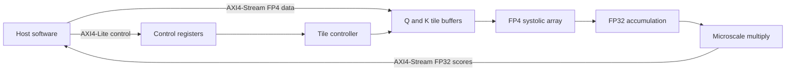

# FP4 QK^T Accelerator Chiplet

[](https://github.com/vamsireddysup/ECE510-H4AI/actions/workflows/ci.yml)

I started this project in ECE 510 at Portland State University and now use it
as my main hardware-AI development repository. The accelerator computes the
`Q * K^T` part of transformer attention with FP4 E2M1 inputs, FP32 accumulation,
and per-row microscaling.

## Current status

| Item | Current result |
| --- | --- |
| Active design | 4x4 systolic array, `D_HEAD=4` |
| End-to-end simulation | 16/16 outputs correct |
| Control status | `DONE=YES`, `TILE_COUNT=1` |
| Compatibility timing | 498 simulation cycles |
| RTL checks | Verilator lint passes |
| Reference model | 19 tests pass; all 256 FP4 products match RTL |
| Physical design record | Sky130 HD, DRC=0, LVS clean, XOR clean |
| Measured clock target | 15 ns constraint, about 62 MHz recommended |
| Larger design | 16x16 is still a target, not a measured result |

The active design has moved beyond the original M4 controller behavior: the
integration test now requires completion status as well as correct numerical
output. I have not yet verified multi-tile execution.

## How it works



The host loads Q and K tiles and their scale factors. The controller feeds one
head-dimension column per cycle into the array. Each PE converts its FP4 product
to FP32 and accumulates the dot product. The output path applies the Q and K
scale factors before returning the score matrix.

## Run it

The local baseline requires Verilator, `g++`, GNU Make, and Python 3.10 or newer.

```bash
make doctor
make test
```

Useful individual commands:

```bash
make check-docs       # Check active Markdown structure and links
make lint             # Lint the active RTL
make test-model       # Test FP4 and QK^T reference behavior
make test-integration # Build and run the active 4x4 design
make baseline         # Re-run the untouched M4 numerical baseline
make clean            # Remove repository-local generated output
```

Generated binaries, logs, and waveforms stay under the ignored `build/`
directory. The latest reviewed test record is in
[docs/results/latest-verification.md](docs/results/latest-verification.md).

## Repository map

```text
rtl/        active SystemVerilog design
tb/         active unit and integration testbenches
model/      Python FP4 and QK^T reference model
scripts/    lint, test, cleanup, and tool-check commands
config/     synthesis and physical-design configuration as it is added
docs/       architecture notes, plans, decisions, and reviewed results
project/    original M1-M4 coursework snapshots
codefest/   separate weekly course exercises
```

I make new design changes only under `rtl/`, `tb/`, and `model/`. I keep the M1
through M4 folders unchanged so the submitted work and its results remain easy
to trace.

## Measured M4 physical results

The final course run synthesized the flat 4x4 array wrapper, not the complete
chiplet top.

| Metric | Recorded value |
| --- | ---: |
| Standard cells | 30,689 |
| Synthesis area | 324,753 um^2 |
| Typical power | 28.1 mW |
| Clock period | 15.0 ns |
| Signoff | DRC=0, LVS clean, XOR clean |

The original 250 MHz goal did not close after routing. The FP32 accumulation
path and clock-tree margin required a longer period. I discuss the measured and
projected numbers in [the M4 benchmark](project/m4/bench/benchmark.md) and
[the final design report](project/m4/report/design_justification.pdf).

## Documentation

- [Documentation index](docs/README.md)
- [Project context and known limits](docs/PROJECT_CONTEXT.md)
- [Repository reorganization plan](docs/REPOSITORY_REORGANIZATION_PLAN.md)
- [Development roadmap](docs/DEVELOPMENT_ROADMAP.md)
- [Contribution workflow](CONTRIBUTING.md)
- [Original M4 package](project/m4/README.md)

## Next work

1. Add a multi-tile regression that fails on the current one-shot PE behavior.
2. Reset PE and array tile-local state without resetting the whole chip.
3. Define and test the 64-bit stream packing rules.
4. Test `D_HEAD=64`, then 8x8 and 16x16 arrays with measured results.
5. Synthesize the full integrated top and keep it separate from array-only data.
