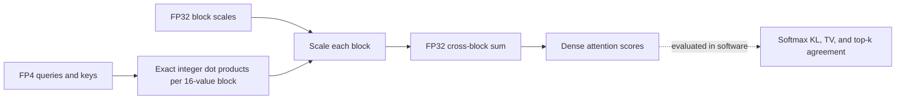

# FP4 transformer attention accelerator

[](https://github.com/vamsireddysup/ECE510-H4AI/actions/workflows/ci.yml)

This repository is the owner's hardware-software co-design program for an FP4
chip accelerator for transformer attention. The software side provides a Python
reference model, quantization experiments, softmax-quality metrics, and pinned
real activation captures. The hardware side provides a parameterized
SystemVerilog datapath and a Sky130 synthesis and physical-design flow. Format,
block size, accumulation, and array decisions are made from measurements across
both sides.

For a reader new to attention, a transformer compares each token's query vector
with every token's key vector. The matrix product `QK^T` produces those
comparison scores before softmax turns each row into attention probabilities.
The active P0 engine computes this matrix using FP4 E2M1 inputs, one FP32 scale
per 16 reduction elements, exact block-local integer accumulation, and FP32
output scores.


```mermaid
flowchart LR
    A[FP4 queries and keys] --> B[Exact integer dot products per 16-value block]
    S[FP32 block scales] --> C[Scale each block]
    B --> C
    C --> D[FP32 cross-block sum]
    D --> E[Dense attention scores]
    E -. evaluated in software .-> F[Softmax KL, TV, and top-k agreement]
```

## Research program

| Problem | Owner's question | Status |
| --- | --- | --- |
| [P0](docs/problem-statements/p0-dense-fp4-matmul.md) | Build dense FP4 `QK^T` matrix multiplication that is accurate, efficient, and physically closed | Active |
| [P1](docs/problem-statements/p1-format-agile-sparsity.md) | Dynamically select FP4, INT4, or FP8 precision and exploit sparsity by layer and workload to minimize traffic and energy while maintaining accuracy | Next; waits for P0 physical closure |
| [P2](docs/problem-statements/p2-programmable-accelerator.md) | Dynamically reconfigure compute array, precision, memory allocation, and dataflow across different AI models | Shelved |

## Results at a glance

The CPU reference is a 9.016 ms one-thread NumPy observation on the recorded
host. Period-derived latency uses simulated cycles multiplied by the measured
4x4 setup-only bound; it is a projection until that configuration routes and
passes hold.

| Result | Human-scale value | Evidence |
| --- | --- | --- |
| 4x4, one score lane, T=512 | 1,050,696 cycles; **32.0 ms at 32.8 MHz**, 3.6x slower than CPU | Projected latency from measured RTL simulation and a routed 30.5 ns setup bound; hold fails |
| 16x16, four score lanes, T=512 | 133,392 cycles; **4.07 ms**, 2.2x faster than CPU | Projected from RTL simulation and the 4x4 period; 16x16 route is blocked |
| Eight replicated 4x4 engines with K reuse | 134,194 cycles; **4.09 ms** | Projected cycle model; no replicated-engine RTL exists |
| Selected `Bs=16` precision | **9.70%** relative Frobenius error on pinned real BERT activations | Measured software model |
| Routed 4x4 physical result | **4.84 mm²** die; DRC and LVS clean | Measured EDA output; hold is -1.2765 ns and power is invalid |

The 30.5 ns number is a routed setup bound, not a timing-closed clock. Antenna,
slew, fanout, and hold violations remain. See [physical design](docs/results/physical-design.md)
and [performance results](docs/results/performance.md) for provenance and limits.

## Choose a path

### Five-minute read

1. Read the [glossary](docs/glossary.md).
2. Read the [architecture](docs/architecture.md) and [attention precision results](docs/results/precision.md).
3. Check [project status](docs/project-status.md) and the [active research question](docs/problem-statements/p0-dense-fp4-matmul.md).

### Run it

From the repository root:

```bash
make doctor
make test
make test-integration-large
make test-precision-rtl
make report-sim
```

`make test` checks documentation, eight RTL parameter sets, the Python model,
and small integration cases. The large integration target runs T=64/128/512.
Generated binaries and logs stay under ignored `build/`. NumPy dependencies are
declared in the test extra; Sky130 synthesis and physical design also require the
PDK and tools listed in the [results record](docs/results/physical-design.md).

### Contribute

Read [CONTRIBUTING.md](CONTRIBUTING.md), then use the
[verification plan](docs/verification-plan.md) for the relevant change. The
[stream contract](docs/stream-protocol.md), [protocol history](docs/protocol-history.md),
and [decision records](docs/adr/README.md) define compatibility boundaries.

## Repository map

- [`rtl/`](rtl/README.md): active synthesizable SystemVerilog
- [`tb/`](tb/README.md): integration testbench and assertions
- [`model/`](model/README.md): exact arithmetic and precision reference
- [`scripts/`](scripts/README.md): reproducible benchmark, model, synthesis, and physical commands
- [`docs/`](docs/README.md): architecture, status, decisions, and reviewed results
- [`archive/`](archive/README.md): retained M4 baseline and load-bearing comparison RTL

The current implementation returns dense scores; masking, hardware softmax, V
multiplication, runtime format selection, P1 RTL, and P2 remain outside the active
stage.

## Related

- [Documentation index](docs/README.md)
- [Project status and plan](docs/project-status.md)
- [Changelog](CHANGELOG.md)
- [Contribution workflow](CONTRIBUTING.md)
