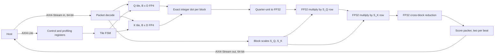

# Architecture

This describes how the active `qkt_chiplet_top` computes `Q * K^T`, and what each
phase of its state machine costs in cycles. Read it before changing the datapath
or the tile schedule. For the wire-level contract and the register map, see
[stream protocol](stream-protocol.md). For what has been measured, see
[the packed engine result](results/packed-engine.md).

The engine computes dense attention scores only. Masking, softmax, and the
multiplication by V stay on the host.

## Blocks

The active design is one top plus five arithmetic and control submodules. Everything else in the
original datapath is in
[`archive/superseded-rtl/`](../archive/superseded-rtl/README.md).

| Block | Source | Job |
| --- | --- | --- |
| `qkt_chiplet_top` | [`rtl/top/qkt_chiplet_top.sv`](../rtl/top/qkt_chiplet_top.sv) | Stream sequencing, tile storage, the integer dot-product array, and the output packer |
| `axi4_lite_ctrl` | [`rtl/interfaces/axi4_lite_ctrl.sv`](../rtl/interfaces/axi4_lite_ctrl.sv) | Control and profiling registers |
| `score_scaler` | [`rtl/core/score_scaler.sv`](../rtl/core/score_scaler.sv) | Parameterized score-scaling lanes and their six-cycle metadata pipeline |
| `fp32_mul` | [`rtl/core/fp32_mul.sv`](../rtl/core/fp32_mul.sv) | Three-stage FP32 multiplier, instantiated twice per scaler lane |
| `score_reducer` | [`rtl/core/score_reducer.sv`](../rtl/core/score_reducer.sv) | Pipelined combination of the scaled block scores |
| `fp32_add` | [`rtl/core/fp32_add.sv`](../rtl/core/fp32_add.sv) | Three-stage FP32 cross-block adder |

## Dataflow



Each FP4 code is E2M1 with magnitudes 0, 0.5, 1, 1.5, 2, 3, 4, 6 and a sign bit.
Both zero encodings decode to zero. The decode returns the magnitude in half
units, so the integer set is 0, 1, 2, 3, 4, 6, 8, 12, and the product of two
operands is exact in quarter units. Each reduction block has its own accumulator.
With the default `SCALE_BLOCK_SIZE=32`, the worst-case block sum is
`144 * 32 = 4608`, so 14 signed bits hold it exactly. The parameterized width is
derived from the block depth, including a partial final block.

Every block accumulator converts to FP32 and passes through its own pair of Q
and K scale multipliers. `score_reducer` then uses one three-stage FP32 add for
the default two blocks. The custom multiplier and adder round finite normal
results to nearest even, which makes the complete default path bit-exact with
the NumPy FP32 model on the pinned T=512 workload. Gradual underflow and every
IEEE exception and signed-zero rule are not implemented.

## Tile schedule

Four independent sequencers move output tiles through load, compute, scale, and
output. Two Q banks let the input stream fill the next tile row while the current
row computes. Two K banks, two exact-accumulator banks, and two FP32 score banks
form ready/valid boundaries between the stages. A bank changes owner only after
its consumer finishes, so input and output backpressure cannot overwrite live
data.

The loader still observes Q-row-major packet order. Version 1 can accept the next
K packet while `CALC` reads the other K bank, and it can accept the next Q packet
once the last calculation using the old Q bank finishes. Version 2 loads the K
cache before Q and bypasses K ping-pong. Both versions preserve output tile order.

`score_scaler` owns the exact-quarter-unit conversion and the two chained FP32
multipliers. The top instantiates one scaler lane per block for every concurrent
score lane, so blocks scale in parallel. `SCORE_LANES` controls concurrent
scores; its default is one. `score_reducer` combines corresponding block lanes.

## Cycle cost model

[`scripts/cycle_model.py`](../scripts/cycle_model.py) derives the no-stall command
count and reproduces all 16 measured configurations exactly. For tile size `B`,
depth `D`, block size `Bs`, score lanes `L`, and block count
`C=ceil(D/Bs)`, concurrent stage service times are:

| Stage | Cycles per tile | Why |
| --- | ---: | --- |
| `LOAD_K`, version 3 | `ceil(B*D/16)` | 16 FP4 codes per accepted input beat |
| `CALC` | `D` | the first products initialize the accumulator bank, followed by `D-1` updates |
| `SCALING` | `ceil(B^2/L) + 6 + 3*(C-1)` | `L` score launches per cycle, multiplier drain, and cross-block-add drain |
| `OUTPUT` | `ceil(B^2/2)` | two FP32 scores per accepted output beat |

For `N=(T/B)^2` complete tiles, `Qbeats=ceil(B*D/16)`, and continuously ready
streams, the exact model is:

```text
pipeline = sum(stage costs) + (N-1) * max(stage costs)
version 3 = T*C + Qbeats + pipeline
version 4 = T*C + (T/B)*Qbeats + Qbeats + pipeline_without_LOAD_K
```

The leading `T*C` loads the scale packet. Version 3 then fills the first Q bank;
`LOAD_K` is already part of its tile pipeline. Version 4 fills the complete K
cache and the first Q bank before its tile pipeline. Later Q loads fit behind the
binding stage for these measured configurations.

### Model against measurement

Measured at revision `1311eb0` with Verilator 5.041, Bs=32, `SCORE_LANES=1`,
and continuously ready streams, `D_HEAD=64`:

| Configuration | Model | Measured | Previous serial RTL | Speedup |
| --- | ---: | ---: | ---: | ---: |
| v3 4x4, T=64 | 16,577 | 16,577 | 28,736 | 1.734x |
| v3 4x4, T=128 | 65,857 | 65,857 | 114,304 | 1.736x |
| v3 4x4, T=512 | 1,049,665 | 1,049,665 | 1,821,184 | 1.735x |
| v4 4x4, T=512 | 1,051,697 | 1,051,697 | 1,561,088 | 1.484x |
| v3 8x8, T=512 | 300,192 | 300,192 | 817,664 | 2.724x |
| v3 16x16, T=512 | 272,704 | 272,704 | 534,016 | 1.958x |

Block scales add 512 input beats: version 3 4x4 transfers 265,216 beats at
T=512 and version 4 transfers 5,120. Version 4 is 2,032 cycles slower because its
2,048-cycle full-K-cache fill is command startup, while version 3 hides repeated
16-cycle K loads behind 64-cycle calculation. K reuse removes 2,080,768
host bytes; P0.5 must decide whether that traffic reduction justifies physical
storage.

## Binding stages after overlap

| Tile | `LOAD_K` | `CALC` | `SCALING` | `OUTPUT` | Binding stage | Steady tiles | Fill/drain | Measured T=512 |
| ---: | ---: | ---: | ---: | ---: | --- | ---: | ---: | ---: |
| 4x4 | 16 | 64 | 25 | 8 | `CALC`, 64 | 1,048,576 | 1,089 | 1,049,665 |
| 8x8 | 32 | 64 | 73 | 32 | `SCALING`, 73 | 299,008 | 1,184 | 300,192 |
| 16x16 | 64 | 64 | 265 | 128 | `SCALING`, 265 | 271,360 | 1,344 | 272,704 |

At 4x4 the dot array runs for 1,048,576 of 1,049,665 command cycles, so measured
array-active is 99.896%. The 1,089 remaining cycles are scale loading,
first Q/K fill, scale-pipeline drain, and final output drain. They are command
latency rather than a sustained bubble. The measured 1.735x gain is slightly
below the 1.74x steady-state estimate for that reason.

The one-score-lane default binds in scaling for both larger arrays. At 8x8,
two score lanes reduce scaling to 41 cycles per tile, so the 64-cycle CALC stage
binds; four lanes only reduce the T=512 result from 263,305 to 263,289 cycles.
Output cannot bind at 8x8 because its 32 cycles are below CALC. At 16x16, two
lanes leave scaling binding at 137 cycles, while four lanes reduce it to 73 and
move the binding stage to the 128-cycle output. The measured four-lane result is
132,361 cycles: the 131,072-cycle output floor plus 1,289 fill and drain cycles.
P0.6 therefore keeps the 64-bit port and selects two lanes for 8x8 or four for
16x16 if either larger array survives physical evaluation.

## Known limits

The active RTL uses one FP32 value per 32 reduction elements by default, with
the block size parameterized. ADR 0004 selects 1x16 for a future versioned
contract after the real-activation sweep. Neither FP32 format is OCP MXFP4,
which uses 32-value blocks with E8M0 scales.

The version 4 K scratchpad is a register array with parallel row reads. At full
capacity it maps to 6,672,971 um² against 1,596,280 um² for version 3, so it is
an experiment rather than the default.

The first complete 4x4 route is DRC/LVS clean but fails setup, hold, antenna,
slew, and fanout checks. Its power report is invalid, so there is still no
timing-closed frequency, latency in seconds, or energy figure. See the
[physical-design result](results/physical-design.md).

## Related

- [Stream protocol and register map](stream-protocol.md)
- [ADR 0001: why the accumulator is exact integer](adr/0001-exact-integer-accumulation.md)
- [ADR 0002: why K reload is the default](adr/0002-k-reload-is-the-default.md)
- [Project context](project-context.md)
- [Development plan](roadmap.md)
- [Design-space experiment](results/design-space.md)
- [Packed engine result](results/packed-engine.md)
- [Documentation index](README.md)
