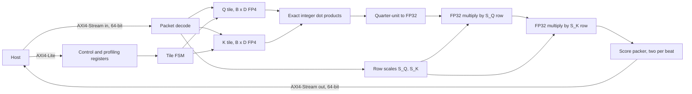

# Architecture

This describes how the active `qkt_chiplet_top` computes `Q * K^T`, and what each
phase of its state machine costs in cycles. Read it before changing the datapath
or the tile schedule. For the wire-level contract and the register map, see
[stream protocol](stream-protocol.md). For what has been measured, see
[the packed engine result](results/packed-engine.md).

The engine computes dense attention scores only. Masking, softmax, and the
multiplication by V stay on the host.

## Blocks

The active design is one module plus two submodules. Everything else in the
original datapath is in
[`archive/superseded-rtl/`](../archive/superseded-rtl/README.md).

| Block | Source | Job |
| --- | --- | --- |
| `qkt_chiplet_top` | [`rtl/top/qkt_chiplet_top.sv`](../rtl/top/qkt_chiplet_top.sv) | Stream sequencing, tile storage, the integer dot-product array, and the output packer |
| `axi4_lite_ctrl` | [`rtl/interfaces/axi4_lite_ctrl.sv`](../rtl/interfaces/axi4_lite_ctrl.sv) | Control and profiling registers |
| `fp32_mul` | [`rtl/core/fp32_mul.sv`](../rtl/core/fp32_mul.sv) | Three-stage FP32 multiplier, instantiated twice for the two row scales |

## Dataflow



Each FP4 code is E2M1 with magnitudes 0, 0.5, 1, 1.5, 2, 3, 4, 6 and a sign bit.
Both zero encodings decode to zero. The decode returns the magnitude in half
units, so the integer set is 0, 1, 2, 3, 4, 6, 8, 12, and the product of two
operands is exact in quarter units. At `D_HEAD=64` the worst-case sum is
`144 * 64 = 9216`, so `ceil(log2(9217)) + 1 = 15` signed bits hold it exactly.
That is `ACC_W` in the RTL. The accumulator converts to FP32 once per score, then
the two chained multipliers apply the Q row scale and the K row scale.

The consequence worth stating: there is no floating-point adder anywhere in the
reduction. All rounding happens in the single conversion and in the two scale
multiplies. The FP32 multiplier is a custom unit without complete IEEE rounding
and subnormal handling, so accuracy beyond binary-power scales is not yet
qualified.

## Tile schedule

The FSM walks output tiles in Q-row-major order. For each Q tile row it loads
one Q tile, then for each K tile column it loads a K tile, computes, scales, and
emits one output tile. Phases do not overlap: the FSM is in exactly one of
`SCALES`, `LOAD_Q`, `LOAD_K`, `CALC`, `SCALING`, `OUTPUT`, or `ADVANCE`.

Protocol version 2 (`K_REUSE=1`) loads every K tile once per command into an
on-chip scratchpad, then streams Q, removing `LOAD_K` from the per-tile loop.

## Cycle cost model

The model below is derived from the FSM and reproduces every measured
configuration exactly. Run
[`scripts/cycle_model.py`](../scripts/cycle_model.py) to check it; a mismatch
means the FSM changed or this document is stale.

Per output tile, with tile size `B` and reduction depth `D`:

| Phase | Cycles | Why |
| --- | --- | --- |
| `LOAD_K` | `ceil(B*D/16)` | 16 FP4 codes per 64-bit beat |
| `CALC` | `D` | one reduction step per cycle, all `B^2` products in parallel |
| `SCALING` | `B^2 + 6` | one score launched per cycle, plus six cycles of chained multiplier latency |
| `OUTPUT` | `ceil(B^2/2)` | two FP32 scores per 64-bit beat |
| `ADVANCE` | 1 | |

For a command of sequence length `T` that is a multiple of `B`, with
`rows = T/B`:

```text
version 1: T + rows*ceil(B*D/16) + rows^2 * (per-tile total)
version 2: T + 2*rows*ceil(B*D/16) + rows^2 * (per-tile total minus LOAD_K)
```

The leading `T` is the scale packet, which carries two FP32 values per beat for
`2T` values.

### Model against measurement

Continuously ready host, `D_HEAD=64`, Verilator 5.020 and 5.042 agreeing.

| Configuration | Model | Measured |
| --- | ---: | ---: |
| v1 4x4, T=64 | 28,736 | 28,736 |
| v1 4x4, T=128 | 114,304 | 114,304 |
| v1 4x4, T=512 | 1,821,184 | 1,821,184 |
| v2 4x4, T=512 | 1,561,088 | 1,561,088 |
| v1 8x8, T=512 | 817,664 | 817,664 |
| v1 16x16, T=512 | 534,016 | 534,016 |

Input beats match exactly too: 264,704 for v1 4x4 at T=512, and 4,608 for v2,
which is the 57.4x reduction in input traffic that command-level K reuse buys.

## Where the cycles go, and what binds next

Because the phases are serial, the per-tile cost is their sum. If they were
overlapped, the cost would be their maximum. At `D_HEAD=64`:

| Tile | `LOAD_K` | `CALC` | `SCALING` | `OUTPUT` | Serial sum | Binding stage under overlap | T=512 if overlapped |
| ---: | ---: | ---: | ---: | ---: | ---: | --- | ---: |
| 4x4 | 16 | 64 | 22 | 8 | 111 | `CALC`, 64 | 1,048,576 |
| 8x8 | 32 | 64 | 70 | 32 | 199 | `SCALING`, 70 | 286,720 |
| 16x16 | 64 | 64 | 262 | 128 | 519 | `SCALING`, 262 | 268,288 |

Three conclusions follow, and the third corrects an assumption in
[the roadmap](roadmap.md).

At 4x4, overlapping the phases is worth `1,821,184 / 1,048,576 = 1.74x`, and the
array then runs at its arithmetic ceiling of `B^2 = 16` products per cycle. This
is why array-active is 57.58% today: `64/111 = 0.577`.

Growing the array without overlapping first buys idle silicon. Array-active falls
to 32.06% at 8x8 and 12.27% at 16x16, because `CALC` stays at `D` while the
serial phases grow with `B^2`.

At 8x8 and 16x16 the stage that binds under overlap is `SCALING`, not the output
port. The roadmap expects the 64-bit output cap of two scores per cycle to become
the limit. It does not, because `SCALING` launches one score per cycle and so
costs `B^2 + 6` against the output's `ceil(B^2/2)`, which is roughly twice as
long for any `B`. The output port only binds once `SCALING` is parallelized: with
`SCALING` removed as a constraint, 16x16 at T=512 would take `1024 * 128 =
131,072` cycles, which equals `262,144 / 2`, exactly the output-port floor.

That makes the scale pipeline the first thing to widen, and it is cheap to widen
if the scales become powers of two, because a power-of-two scale is an exponent
addition rather than a multiplication. Row scaling is currently FP32 and 1x`D`
wide, which is also the accuracy problem recorded in
[the precision result](results/precision.md).

## Known limits

The scale granularity is one FP32 value per Q row and per K row across the whole
reduction, so a 1x64 block at `D_HEAD=64`. That is not OCP MXFP4, which specifies
32-value blocks with E8M0 scales. The measured synthetic relative Frobenius error
is 14.90% at T=512.

The version 2 K scratchpad is a register array with parallel row reads. At full
capacity it maps to 6,672,971 um² against 1,596,280 um² for version 1, so it is
an experiment rather than the default.

No routed result exists for this top. Every area number is Yosys mapping only, so
there is no frequency, no latency in seconds, and no energy figure.

## Related

- [Stream protocol and register map](stream-protocol.md)
- [ADR 0001: why the accumulator is exact integer](adr/0001-exact-integer-accumulation.md)
- [ADR 0002: why K reload is the default](adr/0002-k-reload-is-the-default.md)
- [Project context](project-context.md)
- [Development plan](roadmap.md)
- [Design-space experiment](results/design-space.md)
- [Packed engine result](results/packed-engine.md)
- [Documentation index](README.md)
