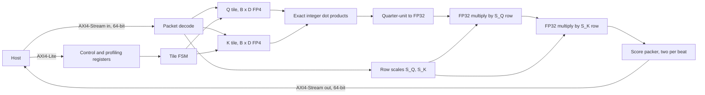

# Architecture

This describes how the active `qkt_chiplet_top` computes `Q * K^T`, and what each
phase of its state machine costs in cycles. Read it before changing the datapath
or the tile schedule. For the wire-level contract and the register map, see
[stream protocol](stream-protocol.md). For what has been measured, see
[the packed engine result](results/packed-engine.md).

The engine computes dense attention scores only. Masking, softmax, and the
multiplication by V stay on the host.

## Blocks

The active design is one top plus three submodules. Everything else in the
original datapath is in
[`archive/superseded-rtl/`](../archive/superseded-rtl/README.md).

| Block | Source | Job |
| --- | --- | --- |
| `qkt_chiplet_top` | [`rtl/top/qkt_chiplet_top.sv`](../rtl/top/qkt_chiplet_top.sv) | Stream sequencing, tile storage, the integer dot-product array, and the output packer |
| `axi4_lite_ctrl` | [`rtl/interfaces/axi4_lite_ctrl.sv`](../rtl/interfaces/axi4_lite_ctrl.sv) | Control and profiling registers |
| `score_scaler` | [`rtl/core/score_scaler.sv`](../rtl/core/score_scaler.sv) | Parameterized score-scaling lanes and their six-cycle metadata pipeline |
| `fp32_mul` | [`rtl/core/fp32_mul.sv`](../rtl/core/fp32_mul.sv) | Three-stage FP32 multiplier, instantiated twice per scaler lane |

## Dataflow



Each FP4 code is E2M1 with magnitudes 0, 0.5, 1, 1.5, 2, 3, 4, 6 and a sign bit.
Both zero encodings decode to zero. The decode returns the magnitude in half
units, so the integer set is 0, 1, 2, 3, 4, 6, 8, 12, and the product of two
operands is exact in quarter units. At `D_HEAD=64` the worst-case sum is
`144 * 64 = 9216`, so `ceil(log2(9217)) + 1 = 15` signed bits hold it exactly.
That is `ACC_W` in the RTL. The accumulator converts to FP32 once per score, then
the two chained multipliers apply the Q row scale and the K row scale.

The consequence worth stating: there is no floating-point adder anywhere in the
reduction. All rounding happens in the single conversion and in the two scale
multiplies. The FP32 multiplier is a custom unit without complete IEEE rounding
and subnormal handling, so accuracy beyond binary-power scales is not yet
qualified.

## Tile schedule

Four independent sequencers move output tiles through load, compute, scale, and
output. Two Q banks let the input stream fill the next tile row while the current
row computes. Two K banks, two exact-accumulator banks, and two FP32 score banks
form ready/valid boundaries between the stages. A bank changes owner only after
its consumer finishes, so input and output backpressure cannot overwrite live
data.

The loader still observes Q-row-major packet order. Version 1 can accept the next
K packet while `CALC` reads the other K bank, and it can accept the next Q packet
once the last calculation using the old Q bank finishes. Version 2 loads the K
cache before Q and bypasses K ping-pong. Both versions preserve output tile order.

`score_scaler` owns the exact-quarter-unit conversion and the two chained FP32
multipliers. `LANES=1` is active. This boundary is where P0.4 will add block-scale
combination and where P0.6 can widen scaling without changing the scheduler.

## Cycle cost model

[`scripts/cycle_model.py`](../scripts/cycle_model.py) derives the no-stall command
count and reproduces all six measured configurations exactly. For tile size `B`
and depth `D`, concurrent stage service times are:

| Stage | Cycles per tile | Why |
| --- | ---: | --- |
| `LOAD_K`, version 1 | `ceil(B*D/16)` | 16 FP4 codes per accepted input beat |
| `CALC` | `D` | the first products initialize the accumulator bank, followed by `D-1` updates |
| `SCALING` | `B^2 + 6` | one score launch per cycle plus chained-multiplier drain |
| `OUTPUT` | `ceil(B^2/2)` | two FP32 scores per accepted output beat |

For `N=(T/B)^2` complete tiles, `Qbeats=ceil(B*D/16)`, and continuously ready
streams, the exact model is:

```text
pipeline = sum(stage costs) + (N-1) * max(stage costs)
version 1 = T + Qbeats + pipeline
version 2 = T + (T/B)*Qbeats + Qbeats + pipeline_without_LOAD_K
```

The leading `T` loads the scale packet. Version 1 then fills the first Q bank;
`LOAD_K` is already part of its tile pipeline. Version 2 fills the complete K
cache and the first Q bank before its tile pipeline. Later Q loads fit behind the
binding stage for these measured configurations.

### Model against measurement

Measured at revision `08a307d` with Verilator 5.041 and continuously ready
streams, `D_HEAD=64`:

| Configuration | Model | Measured | Previous serial RTL | Speedup |
| --- | ---: | ---: | ---: | ---: |
| v1 4x4, T=64 | 16,510 | 16,510 | 28,736 | 1.740x |
| v1 4x4, T=128 | 65,726 | 65,726 | 114,304 | 1.739x |
| v1 4x4, T=512 | 1,049,150 | 1,049,150 | 1,821,184 | 1.736x |
| v2 4x4, T=512 | 1,051,182 | 1,051,182 | 1,561,088 | 1.485x |
| v1 8x8, T=512 | 287,392 | 287,392 | 817,664 | 2.845x |
| v1 16x16, T=512 | 269,120 | 269,120 | 534,016 | 1.984x |

Input traffic is unchanged: 264,704 beats for version 1 4x4 at T=512 and 4,608
for version 2. Version 2 is now 2,032 cycles slower than version 1 because its
2,048-cycle full-K-cache fill is command startup, while version 1 hides repeated
16-cycle K loads behind 64-cycle calculation. K reuse still removes 2,080,768
host bytes; P0.5 must decide whether that traffic reduction justifies physical
storage.

## Binding stages after overlap

| Tile | `LOAD_K` | `CALC` | `SCALING` | `OUTPUT` | Binding stage | Steady tiles | Fill/drain | Measured T=512 |
| ---: | ---: | ---: | ---: | ---: | --- | ---: | ---: | ---: |
| 4x4 | 16 | 64 | 22 | 8 | `CALC`, 64 | 1,048,576 | 574 | 1,049,150 |
| 8x8 | 32 | 64 | 70 | 32 | `SCALING`, 70 | 286,720 | 672 | 287,392 |
| 16x16 | 64 | 64 | 262 | 128 | `SCALING`, 262 | 268,288 | 832 | 269,120 |

At 4x4 the dot array runs for 1,048,576 of 1,049,150 command cycles, so measured
array-active is 99.945%. The 574 remaining cycles are exactly scale loading,
first Q/K fill, scale-pipeline drain, and final output drain. They are command
latency rather than a sustained bubble. The measured 1.736x gain is slightly
below the 1.74x steady-state estimate for that reason.

Scaling binds both larger arrays. Their one-lane scaler sustains one score per
cycle, while output can carry two. P0.6 should therefore evaluate scaler lanes
before changing output width. With scaling removed as a constraint, 16x16 output
would impose the 131,072-cycle steady-state floor, plus command fill and drain.

## Known limits

The active RTL scale granularity remains one FP32 value per Q row and K row across
the whole reduction, so a 1x64 block at `D_HEAD=64`. ADR 0003 selects 1x32 FP32
for P0.4, with block size kept parameterized. That selected format is not OCP
MXFP4, which uses 32-value blocks with E8M0 scales.

The version 2 K scratchpad is a register array with parallel row reads. At full
capacity it maps to 6,672,971 um² against 1,596,280 um² for version 1, so it is
an experiment rather than the default.

No routed result exists for this top. Every area number is Yosys mapping only, so
there is no frequency, no latency in seconds, and no energy figure.

## Related

- [Stream protocol and register map](stream-protocol.md)
- [ADR 0001: why the accumulator is exact integer](adr/0001-exact-integer-accumulation.md)
- [ADR 0002: why K reload is the default](adr/0002-k-reload-is-the-default.md)
- [Project context](project-context.md)
- [Development plan](roadmap.md)
- [Design-space experiment](results/design-space.md)
- [Packed engine result](results/packed-engine.md)
- [Documentation index](README.md)
