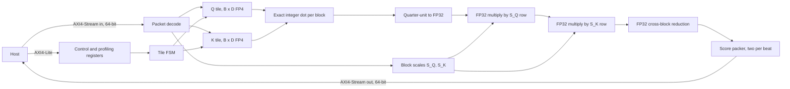

# Architecture

This describes how the active `qkt_chiplet_top` computes `Q * K^T`, and what each
phase of its state machine costs in cycles. Read it before changing the datapath
or the tile schedule. For the wire-level contract and the register map, see
[stream protocol](stream-protocol.md). For what has been measured, see
[the packed engine result](results/performance.md).

The engine computes dense attention scores only. Masking, softmax, and the
multiplication by V stay on the host.

## Blocks

The active design is one top plus five arithmetic and control submodules. Everything else in the
original datapath is in
[`archive/superseded-rtl/`](../archive/superseded-rtl/README.md).

| Block | Source | Job |
| --- | --- | --- |
| `qkt_chiplet_top` | [`rtl/top/qkt_chiplet_top.sv`](../rtl/top/qkt_chiplet_top.sv) | Stream sequencing, shared Q/K/scale storage, engine dispatch, ordered retirement, and the output packer |
| `qkt_engine` | [`rtl/core/qkt_engine.sv`](../rtl/core/qkt_engine.sv) | One private K tile pair, exact accumulators, score scaling, and score banks |
| `axi4_lite_ctrl` | [`rtl/interfaces/axi4_lite_ctrl.sv`](../rtl/interfaces/axi4_lite_ctrl.sv) | Control and profiling registers |
| `score_scaler` | [`rtl/core/score_scaler.sv`](../rtl/core/score_scaler.sv) | Parameterized score-scaling lanes and their six-cycle metadata pipeline |
| `fp32_mul` | [`rtl/core/fp32_mul.sv`](../rtl/core/fp32_mul.sv) | Three-stage FP32 multiplier, instantiated twice per scaler lane |
| `fp32_add` | [`rtl/core/fp32_add.sv`](../rtl/core/fp32_add.sv) | Three-stage FP32 cross-block adder |

## Dataflow


```mermaid
flowchart LR
    Host[Host] -->|AXI4-Lite| Ctrl[Control and profiling registers]
    Host -->|"AXI4-Stream in, 64-bit"| Pack[Packet decode]
    Pack --> SQ[Block scales S_Q, S_K]
    Pack --> QT[Q tile, B x D FP4]
    Pack --> KT[K tile, B x D FP4]
    Ctrl --> FSM[Tile FSM]
    FSM --> QT
    FSM --> KT
    QT --> Dot[Exact integer dot per block]
    KT --> Dot
    Dot --> Conv[Quarter-unit to FP32]
    Conv --> M1[FP32 multiply by S_Q row]
    SQ --> M1
    M1 --> M2[FP32 multiply by S_K row]
    SQ --> M2
    M2 --> Add[FP32 cross-block reduction]
    Add --> Out[Score packer, two per beat]
    Out -->|"AXI4-Stream out, 64-bit"| Host
```

Each FP4 code is E2M1 with magnitudes 0, 0.5, 1, 1.5, 2, 3, 4, 6 and a sign bit.
Both zero encodings decode to zero. The decode returns the magnitude in half
units, so the integer set is 0, 1, 2, 3, 4, 6, 8, 12, and the product of two
operands is exact in quarter units. Two ping-pong accumulators each hold one
completed reduction block.
With the default `SCALE_BLOCK_SIZE=16`, the worst-case block sum is
`144 * 16 = 2304`, so 13 signed bits hold it exactly. The parameterized width is
derived from the block depth, including a partial final block.

As compute starts the next block, the completed block streams through the
quarter-unit conversion and Q/K scale pipeline. Block zero seeds a partial
score array; later blocks pass through one three-stage FP32 adder in sequence.
The custom multiplier and adder round finite normal
results to nearest even, which makes the complete default path bit-exact with
the NumPy FP32 model on the pinned T=512 workload. Gradual underflow and every
IEEE exception and signed-zero rule are not implemented.

## Tile schedule

Four independent sequencers move output tiles through load, compute, scale, and
output. Two Q banks let the input stream fill the next tile row while the current
row computes. Two K banks, two block-local accumulator banks, and two FP32 score banks
form ready/valid boundaries between the stages. A bank changes owner only after
its consumer finishes, so input and output backpressure cannot overwrite live
data.

The loader still observes Q-row-major packet order. The K-reload protocols can accept the next
K packet while `CALC` reads the other K bank, and it can accept the next Q packet
once the last calculation using the old Q bank finishes. The K-reuse protocols
load the K cache before Q and bypass K ping-pong. Every version preserves output
tile order.

`score_scaler` owns the exact-quarter-unit conversion and the two chained FP32
multipliers. `SCORE_LANES` controls concurrent scores within the block being
drained; its default is one. Blocks stream in reduction order, and the FP32
adder updates the partial score before the same score arrives from the next
block. This removes the tile-wide block accumulator and its dynamic read mux.

## Cycle cost model

[`scripts/cycle_model.py`](../scripts/cycle_model.py) derives the no-stall command
count and reproduces all 44 measured configurations exactly. For tile size `B`,
depth `D`, block size `Bs`, score lanes `L`, and block count
`C=ceil(D/Bs)`, concurrent stage service times are:

| Stage | Cycles per tile | Why |
| --- | ---: | --- |
| `LOAD_K`, K reload | `ceil(B*D/16)` | 16 FP4 codes per accepted input beat |
| `CALC` | `D` | the first products initialize the accumulator bank, followed by `D-1` updates |
| `SCALING` | `C*ceil(B^2/L)` | every score in every block launches once; pipeline latency overlaps launches |
| `OUTPUT` | `ceil(B^2/2)` | two FP32 scores per accepted output beat |

For `N=(T/B)^2` complete tiles, `Qbeats=ceil(B*D/16)`, scale-packet length
`S=ceil(2*T*C/P)` where `P=2` for FP32 and `P=8` for E4M3, and continuously
ready streams, the exact model is:

```text
pipeline = sum(stage costs) + (N-1) * max(stage costs)
K reload = S + Qbeats + pipeline
K reuse = S + (T/B)*Qbeats + Qbeats + pipeline_without_LOAD_K
```

The leading `S` loads the scale packet. K reload then fills the first Q bank;
`LOAD_K` is already part of its tile pipeline. K reuse fills the complete K
cache and the first Q bank before its tile pipeline. Later Q loads fit behind the
binding stage for these measured configurations.

### Model against measurement

Measured at revision `782619d` with Verilator 5.041, Bs=32, `SCORE_LANES=1`,
and continuously ready streams, `D_HEAD=64`:

| Configuration | Model | Measured | Previous serial RTL | Speedup |
| --- | ---: | ---: | ---: | ---: |
| v3 4x4, T=64 | 16,578 | 16,578 | 28,736 | 1.734x |
| v3 4x4, T=128 | 65,858 | 65,858 | 114,304 | 1.736x |
| v3 4x4, T=512 | 1,049,666 | 1,049,666 | 1,821,184 | 1.735x |
| v4 4x4, T=512 | 1,051,698 | 1,051,698 | 1,561,088 | 1.484x |
| v3 8x8, T=512 | 304,288 | 304,288 | 817,664 | 2.687x |
| v3 16x16, T=512 | 273,728 | 273,728 | 534,016 | 1.951x |

Block scales add 512 input beats: version 3 4x4 transfers 265,216 beats at
T=512 and version 4 transfers 5,120. Version 4 is 2,032 cycles slower because its
2,048-cycle full-K-cache fill is command startup, while version 3 hides repeated
16-cycle K loads behind 64-cycle calculation. K reuse removes 2,080,768
host bytes; P0.5 must decide whether that traffic reduction justifies physical
storage.

The Bs=16 default was remeasured after block streaming with the same Verilator
version. Version 5 takes 1,050,690 cycles and 266,240 input beats at
4x4/T=512; version 6 takes 1,052,722 cycles and 6,144 input beats. The 8x8 L2
and 16x16 L4 defaults take 526,458 and 264,474 cycles. The model reproduces all
32 counts exactly. Versions 3 and 4 remain the measured Bs=32
compatibility points in the table above.

## Binding stages after overlap

| Tile | `LOAD_K` | `CALC` | `SCALING` | `OUTPUT` | Binding stage | Steady tiles | Fill/drain | Measured T=512 |
| ---: | ---: | ---: | ---: | ---: | --- | ---: | ---: | ---: |
| 4x4 | 16 | 64 | 26 | 8 | `CALC`, 64 | 1,048,576 | 1,090 | 1,049,666 |
| 8x8 | 32 | 64 | 74 | 32 | `SCALING`, 74 | 303,104 | 1,184 | 304,288 |
| 16x16 | 64 | 64 | 266 | 128 | `SCALING`, 266 | 272,384 | 1,344 | 273,728 |

Those rows retain Bs=32 and one score lane so the P0.3 comparison stays
reproducible as pre-M2 measurements. At the Bs=16 default, block streaming gives
scaling service of 64 cycles for 4x4 L1, 128 for 8x8 L2, and 256 for 16x16 L4.
CALC ties scaling at 4x4; scaling binds both wider arrays. Their measured T=512
totals are 1,050,690, 526,458, and 264,474 cycles. Wider arrays therefore need
proportionally more within-block score lanes before routing them is useful.

At 4x4 the dot array runs for 1,048,576 of 1,049,666 command cycles, so measured
array-active is 99.896%. The 1,090 remaining cycles are scale loading,
first Q/K fill, scale-pipeline drain, and final output drain. They are command
latency rather than a sustained bubble. The measured 1.735x gain is slightly
below the 1.74x steady-state estimate for that reason.

The one-score-lane default binds in scaling for both larger arrays. At 8x8,
two score lanes reduce scaling to 42 cycles per tile, so the 64-cycle CALC stage
binds; four lanes only reduce the T=512 result from 263,306 to 263,290 cycles.
Output cannot bind at 8x8 because its 32 cycles are below CALC. At 16x16, two
lanes leave scaling binding at 138 cycles, while four lanes reduce it to 74 and
move the binding stage to the 128-cycle output. The measured four-lane result is
132,362 cycles: the 131,072-cycle output floor plus 1,290 fill and drain cycles.
P0.6 therefore keeps the 64-bit port and selects two lanes for 8x8 or four for
16x16 if either larger array survives physical evaluation.

## Replicated engines

`ENGINES` instantiates that many `qkt_engine` blocks under one top. Its default
is 1, where the design is bit-identical and cycle-identical to the
single-engine implementation it replaced.

Work is split by K tile column. Engine `i` owns the output tile columns
congruent to `i` modulo `ENGINES`, so at any moment every engine is working on
the same Q tile row. Three consequences follow.

**Q is broadcast.** One shared pair of Q tile banks feeds every engine. A bank
is handed back to the input frontend only after every engine has released it.
Splitting by flat tile index would instead put engines on different Q rows and
need `ENGINES` private Q banks.

**Retirement is a counter, not a reorder buffer.** The output contract emits
tiles in Q-tile-row order then K-tile-column order, which under this assignment
is exactly round robin across engines. A retire pointer advances one engine per
completed tile and restarts at engine 0 on each new Q row, stalling while the
selected engine's score bank is not valid. Ordering is preserved with no buffer
and no tile ordinal in the data path, so
[ADR 0006](adr/0006-use-replicated-4x4-engines.md)'s reorder buffer is not
required. The restart handles a Q row whose tile-column count is not a multiple
of `ENGINES`; an engine with no tile in a row hands its Q bank straight back.

**Scale reads mostly collapse.** `sq` is indexed by Q row and is common to all
engines. Only the `sk` index differs per engine.

### Shared-read register boundaries

The shared Q banks are read one cycle ahead into a private per-engine register,
so the engine-crossing array read is register to register and no longer shares a
combinational path with E2M1 exponent selection, shift/add product, and
accumulate. The read address is a
counter, so this costs no cycles; depth 0 of a row can be written in the same
cycle `q_valid` is set, and that one nibble per row is snooped off the write beat
at a compile-time-constant beat and lane.

The shared `sq` and `sk` reads already terminate in the existing scale-prefetch
register. Between the last register and the array index there is one adder,
`acc_row + lane_row`, and at the default one score lane the lane term is zero.
The array mux is therefore already register to register, and adding a further
stage would cost a scaling drain cycle without shortening that path. What
replication does add is read-port fanout: `ENGINES` simultaneous indexed reads of
the same `T_MAX x BLOCK_COUNT` storage. That is a storage banking or replication
question rather than a register boundary question, and mapped timing at
checkpoint 2 is the right evidence for deciding it. I have not changed it on
speculation, because the previous critical-path work was driven by measured
mapped timing.

| Resource | Placement |
| --- | --- |
| `axi4_lite_ctrl`, `k_cache`, `sq`, `sk`, `q_bank`, input dispatcher, retire pointer | Shared once in the top |
| `k_bank`, `acc_bank`, `score_bank`, the CALC/SCALING sequencers, `score_scaler`, `score_reducer` | Private per engine |

Under K reload the input dispatcher steers each K tile packet to the engine that
owns its column. Under K reuse each engine burst-fills its private K tile from
the shared cache while the previous tile computes, rather than reading the cache
on every compute cycle. A fill takes `ceil(TILE_SIZE*D_HEAD/16)` cycles, the
same as one K packet, so it hides behind both the Q packet load at command start
and the `D_HEAD`-cycle dot product afterwards. Average shared-cache read rate is
`TILE_SIZE*D_HEAD` bits per engine per tile, or 16 bits per cycle per engine at
4x4 and `D_HEAD=64`.

## Replicated-engine projection

The cycle model also accepts an engine count. N=1 remains exact against all
measurements. For N greater than one, private CALC and SCALING work divide across
engines while the 64-bit input and output ports remain shared. At T=512, four
4x4 engines make version 3 input-bound at 265,216 projected cycles; eight do not
improve it. Version 4 permits eight engines to reach 134,194 projected cycles,
including startup and drain, near the 131,072-cycle output floor. Measured
Bs=16 results confirm both limits, and the model reproduces them exactly
once effective engine count and trailing retirement are derived. The
[replicated-engine study](results/performance.md) gives the derivation,
area breakdown, and ordering decision.

## Known limits

The active RTL uses one FP32 value per 16 reduction elements by default, with
the 1x32 compatibility mode retained. Neither FP32 format is OCP MXFP4,
which uses 32-value blocks with E8M0 scales.

The version 4 K scratchpad is a register array with parallel row reads. At full
capacity it maps to 6,672,971 um² against 1,596,280 um² for version 3, so it is
an experiment rather than the default.

The first complete 4x4 route is DRC/LVS clean but fails setup, hold, antenna,
slew, and fanout checks. Its power report is invalid, so there is still no
timing-closed frequency, latency in seconds, or energy figure. See the
[physical-design result](results/physical-design.md).

## Related

- [Stream protocol and register map](stream-protocol.md)
- [ADR 0001: why the accumulator is exact integer](adr/0001-exact-integer-accumulation.md)
- [ADR 0002: why K reload is the default](adr/0002-k-reload-is-the-default.md)
- [Project context](project-status.md)
- [Development plan](project-status.md)
- [Replicated-engine study](results/performance.md)
- [Design-space experiment](results/performance.md)
- [Packed engine result](results/performance.md)
- [Documentation index](README.md)
